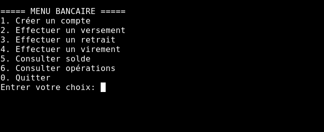
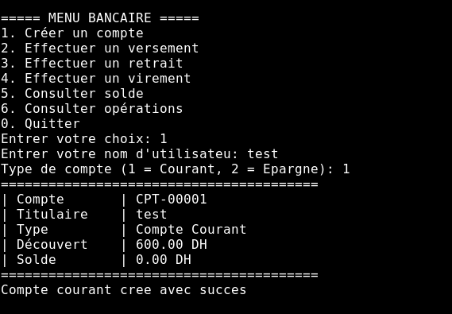
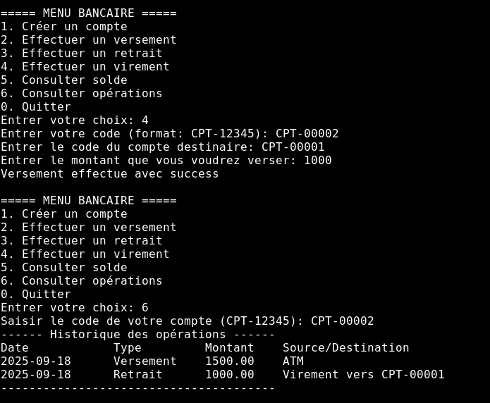
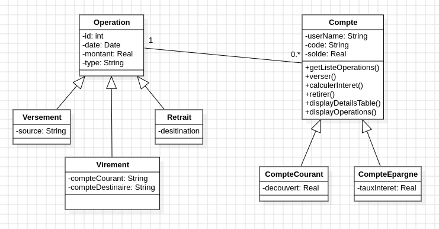

# BANKA MEAK – Système de Gestion de Comptes Bancaires

## Description du projet

BANKA MEAK est une application console Java qui simule un système bancaire simple. Le projet applique les principes de la Programmation Orientée Objet (POO) et est structuré en plusieurs couches pour garantir la clarté et la maintenabilité.

## Fonctionnalités

- Création de différents types de comptes :
  - **Compte Épargne** (avec taux d'intérêt et règles de retrait)
  - **Compte Courant** (avec limite de découvert)
- Connexion à un compte existant via le code (CPT-XXXXX)
- Opérations principales :
  - Versement
  - Retrait (avec règles de validation)
  - Virement entre comptes
  - Consultation du solde et de l’historique des opérations
- Interface utilisateur basée sur la console avec menus et sous-menus
- Stockage en mémoire (ArrayList, HashMap)

Ce projet met en avant :

- Abstraction (classes et méthodes abstraites)
- Héritage et polymorphisme
- redéfinition
- Gestion des exceptions (try-catch)
- Validation des données via des classes utilitaires
- Utilisation des collections Java (`HashMap`, `ArrayList`)
- Java Time API pour la gestion des dates d’opération

## Technologies utilisées

- **Java 8** (langage principal)
- **Eclipse IDE** (développement)
- **Java Time API** (`java.time`)
- **Collections Framework** (`HashMap`, `ArrayList`)

## Structure du projet

```
src/
 ├── bankaMeak/
 |   ├── Main.java          # Point d'entrée de l'application    
 │   ├── model/           # Domaines principaux (Compte, Operation, etc.)
 │   ├── repository/      # Accès aux données (CompteRepository)
 │   ├── service/         # Logique métier (BankService)
 │   ├── ui/              # Interface utilisateur console (menus, sous-menus)
 │   └── util/            # Utilitaires (validation, saisie)
bin/                      # Fichiers compilés
BANKA_MEAK.jar            # Fichier exécutable
README.md                 # Ce fichier
```

- **model/** → Classes du domaine (comptes & opérations)
- **service/** → Couche métier (gestion des comptes, opérations)
- **repository/** → Accès aux données en mémoire
- **util/** → Classes utilitaires (validation, saisie)
- **ui/** → Couche interface utilisateur (menus, affichage)

## Prérequis

- **Java JDK 8** installé
- **Eclipse IDE** (ou tout autre IDE compatible Java 8)

Vérifier la version Java :
```bash
java -version
```

## Comment exécuter

### 1. Importer dans Eclipse

- Ouvrir Eclipse
- Importer le projet existant (`Fichier > Importer > Projet existant`)
- Compiler et exécuter la classe `Main.java` dans `src/bankaMeak/Main.java`

### 2. Exécuter le fichier JAR

```bash
cd bankaMeak
java -jar BANKA_MEAK.jar
```

### 3. Compiler et exécuter manuellement

```bash
cd bankaMeak
mkdir out
javac -d out -sourcepath src src/bankaMeak/Main.java
java -cp out bankaMeak.Main
```

## Captures d'écran






---

**Auteur :**  
Projet individuel réalisé dans le cadre d’une formation Java.

**Dates :**  
16/09/2025 – 19/09/2025
